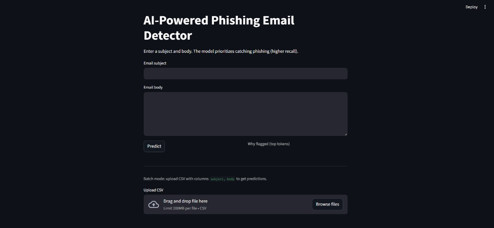

# AI-Powered Phishing Email Detector  

An intelligent system that uses Natural Language Processing (NLP) and Machine Learning to detect phishing emails from legitimate ones.  
The project combines classical models (TF-IDF + Logistic Regression) and transformer-based approaches (BERT) to maximize phishing recall and provide explainable predictions via a Streamlit web interface.  

**Tech Stack:** Python, scikit-learn, Transformers, Streamlit, NLP  
**Goal:** Enhance email security by detecting social engineering threats before they reach users.  

## Demo

Here’s how the Streamlit interface looks when running locally:

The app lets you enter an email subject and body, predicts whether it’s a phishing attempt,  
and also provides a simple explanation of why it was flagged (top tokens).  
You can even upload a CSV of multiple emails for batch detection.