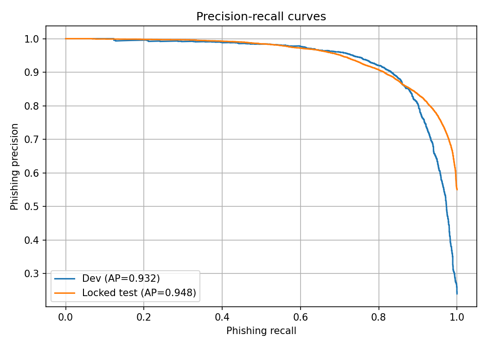
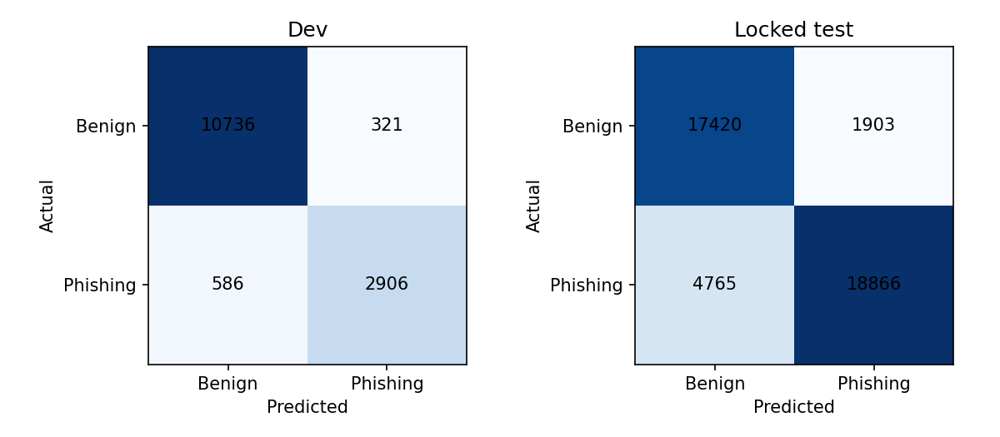
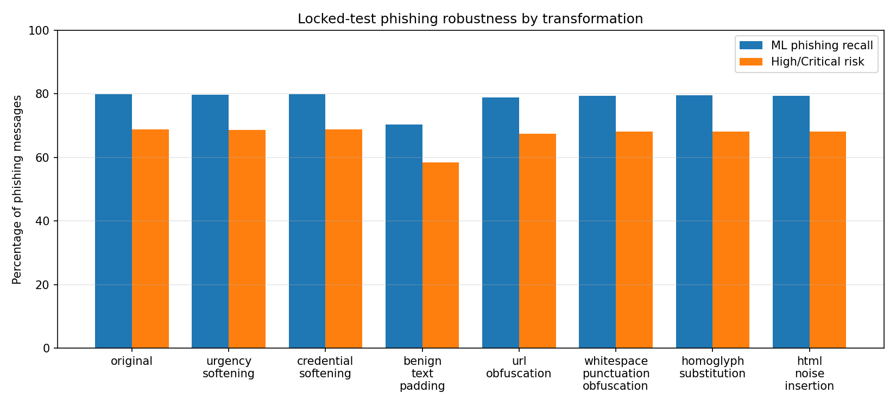

# Phishing Email Detector

## Overview

This repository contains a phishing-email detection and analysis prototype built around a TF-IDF and logistic-regression classifier. It combines the classifier with deterministic security indicators, a transparent triage risk scale, a Streamlit interface, source-disjoint evaluation, and controlled robustness testing.

The system is intended for experimentation and defensive analysis. It is not a replacement for a secure email gateway, sandbox, reputation service, or analyst review.

## What the system does

- Classifies an email as phishing or legitimate using a saved TF-IDF and logistic-regression pipeline.
- Reports the model probability and the classification threshold selected on development data.
- Extracts deterministic evidence such as URLs, email addresses, urgency, credential requests, payment language, suspicious calls to action, and visible/destination URL mismatches.
- Shows logistic-regression feature contributions in both the phishing and legitimate directions.
- Produces a transparent Low, Medium, High, or Critical triage level.
- Supports single-email and bounded batch analysis through Streamlit.
- Audits, deduplicates, and source-splits MeAJOR data through reproducible command-line tools.
- Evaluates controlled phishing-text perturbations against the locked test split.

## Architecture

```text
Manually downloaded MeAJOR CSV
          |
          v
MeAJOR importer ------> canonical email CSV + metadata JSONL
          |
          v
Data-quality audit
          |
          v
Global canonical deduplication and required-field validation
          |
          v
trec5 train | trec6 dev | trec7 locked test
          |
          v
Shared model text preprocessing
          |
          v
TF-IDF + logistic regression ------> saved model bundle
          |                                  |
          |                                  v
          +--------------------------> Streamlit inference
                                             |
                         +-------------------+-------------------+
                         |                                       |
                  model evidence                     deterministic analyzer
                                                                 |
                                                                 v
                                                        triage risk engine
```

Training and application inference use the same `preprocess_email()` implementation. Model text normalizes HTML, case, whitespace, URLs, and email addresses. Duplicate identity uses a separate canonicalization that preserves URLs and addresses so messages with different destinations do not collapse into the same duplicate group.

## Dataset

The project uses **MeAJOR v2.0: Merged email Assets from Joint Open-source Repositories**, published by Francisco Cardoso, João Vitorino, Paulo Mendes, Eva Maia, and Isabel Praça. MeAJOR combines messages originating from TREC-05, TREC-06, TREC-07, the Nazario Phishing Corpus, and Nigerian Fraud, with anonymized email content and extracted metadata.

- Official record: [Zenodo record 18471483](https://zenodo.org/records/18471483)
- DOI: [10.5281/zenodo.18471483](https://doi.org/10.5281/zenodo.18471483)
- Local usable labeled import: **108,684 records**
- After canonical deduplication and required-field validation: **103,100 records**

The full MeAJOR dataset is **not stored in this repository**. Raw and processed dataset paths are ignored by Git. Users must download the dataset manually and comply with the license and attribution requirements stated by the Zenodo record and any applicable upstream corpus terms. The repository's MIT license applies to the project source code and does not relicense MeAJOR or its source corpora.

## Data preparation

The importer maps MeAJOR into the canonical schema:

```text
subject, body, label
```

Additional source fields are preserved in an aligned JSONL metadata sidecar. The preparation pipeline then:

1. Validates canonical CSV and metadata alignment.
2. Rejects unsupported labels.
3. Canonicalizes HTML, case, and whitespace for duplicate detection while preserving URL and email identity.
4. Deduplicates globally before any split.
5. Keeps the first valid input-order representative from same-label duplicate groups.
6. Excludes entire duplicate groups if their labels conflict.
7. Excludes records with a blank subject or body.
8. Creates the model-facing cleaned subject, body, and combined `text` fields.
9. Preserves aligned metadata for every retained split row.

Observed preparation counts:

| Item | Count |
|---|---:|
| Imported labeled records | 108,684 |
| Canonical duplicate groups | 1,044 |
| Duplicate records beyond the first | 4,166 |
| Conflicting-label duplicate groups | 0 |
| Groups excluded for blank subject/body | 1,418 |
| Retained records | 103,100 |

The compact audit and split summaries are stored in `reports/meajor_data_quality.json` and `reports/meajor_split_summary.json`.

## Leakage-aware evaluation design

The final split is source-disjoint:

| Split | Source | Benign | Phishing | Total |
|---|---|---:|---:|---:|
| Train | `trec5` | 26,559 | 19,038 | 45,597 |
| Dev | `trec6` | 11,057 | 3,492 | 14,549 |
| Test | `trec7` | 19,323 | 23,631 | 42,954 |

A random stratified split could place corpus-specific templates, senders, formatting conventions, and collection artifacts in every split. That design can reward memorization of source characteristics and overstate generalization. Global deduplication followed by source-disjoint splitting instead evaluates whether a model trained on one corpus transfers to different corpora.

The tradeoff is intentional: class prevalence and language differ between sources. The resulting test metrics measure transfer to the held-out `trec7` corpus, not expected production performance on arbitrary modern email traffic.

## Baseline model

The baseline is a scikit-learn pipeline containing:

- Word TF-IDF unigrams and bigrams.
- `min_df=2`, `max_df=0.98`, and a 200,000-feature cap.
- Sublinear term frequency and Unicode accent stripping.
- Logistic regression with `class_weight="balanced"`, `C=1.0`, and the `liblinear` solver.
- Fixed random seed 42.

TF-IDF is fitted only on `trec5` training text. The decision threshold is selected only on `trec6` development data by maximizing phishing recall subject to phishing precision being at least 0.90. The chosen threshold is:

```text
0.6506418095611745
```

The `trec7` test split remains outside fitting and threshold selection and is evaluated only after the operating point is fixed.

## Security analyzer

The deterministic analyzer operates on the original subject and body and reports evidence rather than a hidden weighted score. Its indicators include:

- URLs and email addresses.
- Unencrypted HTTP, IP-address, Punycode, user-information, malformed, and visible/destination-domain-mismatch URL patterns.
- Urgency and time-pressure phrases.
- Credential and account-verification requests.
- Payment, invoice, banking, payroll, gift-card, and cryptocurrency language.
- Suspicious calls to action.
- Security-alert and impersonation language.
- Attachment-execution and secrecy/process-bypass phrases.

The Streamlit application also shows the strongest TF-IDF feature contributions pushing toward phishing and toward legitimate. These describe model behavior; they are not causal explanations.

## Risk engine

The risk engine keeps the baseline probability and deterministic indicators separately visible. It maps the ML probability into explicit points and adds one point for each distinct indicator category, capped at four indicator points. Total points map to:

| Risk points | Level |
|---|---|
| 0–1 | Low |
| 2–3 | Medium |
| 4–5 | High |
| 6–8 | Critical |

This risk score is a deterministic triage score, **not a calibrated phishing probability**. The current rules add explainability but provide limited fallback coverage when the classifier produces a false negative.

## Streamlit application

The application provides:

- Single-email subject/body analysis.
- Risk level and risk points.
- Baseline probability, threshold, and classification.
- Rule evidence grouped by category.
- Extracted URLs and email addresses.
- Separate phishing-direction and legitimate-direction model feature contributions.
- Batch CSV analysis for up to 500 rows and 10 MB.
- Input validation and CSV-download formula-injection protection.

Batch input requires `subject` and `body` columns. The application does not write prediction files to the repository.

## Evaluation results

Locked `trec7` test results at threshold `0.6506418095611745`:

| Metric | Result |
|---|---:|
| Phishing precision | 90.84% |
| Phishing recall | 79.84% |
| Phishing F1 | 84.98% |
| Phishing F2 | 81.82% |
| Average precision / PR-AUC | 0.9477 |
| False-positive rate | 9.85% |
| False-negative rate | 20.16% |

The false-positive rate rose from 2.90% on `trec6` dev to 9.85% on `trec7` test, while phishing recall fell from 83.22% to 79.84%. This is evidence of source shift. These results are specific to the historical, anonymized MeAJOR sources and must not be presented as production performance.





Exact metrics and model configuration are stored in `reports/baseline_metrics.json`.

## Robustness testing

The defensive robustness harness applies deterministic transformations only to phishing messages in the locked test split. It evaluates urgency softening, credential-language softening, benign-text padding, URL obfuscation, whitespace/punctuation obfuscation, homoglyph substitution, and HTML noise insertion.

Key results:

| Variant | Phishing recall | Change from original |
|---|---:|---:|
| Original | 79.84% | — |
| Benign-text padding | 70.39% | −9.45 percentage points |
| URL obfuscation | 78.85% | −0.99 percentage points |

Benign-text padding is the largest observed weakness. Adding routine benign language dilutes the normalized TF-IDF representation and increased false negatives from 4,765 to 6,997. The rule engine did not materially compensate: only three of the 6,997 ML false negatives under benign padding remained High/Critical.

The transformations are controlled evaluation perturbations for measuring an existing detector. They are not a claim that the test set covers all realistic attacks or that these results predict real-world adversary success.



Full results are stored in `reports/adversarial_robustness.json`.

## Limitations

- MeAJOR combines historical public corpora and does not represent current production email traffic.
- The usable labeled import and final split contain `trec5`, `trec6`, and `trec7`; the source composition should not be generalized to all corpora named by MeAJOR.
- Source label prevalence differs substantially, making precision and average precision source-dependent.
- The model uses subject/body text only. It does not query domain reputation, inspect attachments, execute content, resolve redirects, or use full transport headers.
- URL and email placeholders in the model text discard destination-specific features; the rule layer retains some original URL evidence separately.
- Deterministic phrase rules are limited, primarily English-language, and readily affected by wording changes.
- The risk scale is policy-based and uncalibrated.
- Controlled robustness transformations are simple and do not represent an exhaustive adversarial evaluation.
- The saved Joblib model must be treated as trusted local data because pickle-compatible formats can execute code during loading.
- The application is a prototype and has not undergone production security hardening or operational monitoring.

## Setup

Python 3.9 or newer is recommended. From a fresh macOS or Linux clone:

```bash
python3 -m venv .venv
source .venv/bin/activate
python -m pip install --upgrade pip
python -m pip install -r requirements.txt
```

Run the complete test suite:

```bash
MPLCONFIGDIR=/tmp/phishing_detector_mpl \
  python -m unittest discover -s tests -v
```

The committed model and reports allow the application and tests to run without downloading MeAJOR. Dataset-related commands require a manual dataset download.

## Usage

### Import MeAJOR

Download `meajor_cleaned_preprocessed.csv` manually from the [official Zenodo record](https://zenodo.org/records/18471483) and place it at:

```text
data/raw/meajor_cleaned_preprocessed.csv
```

Then run:

```bash
python src/import_meajor.py \
  --input data/raw/meajor_cleaned_preprocessed.csv \
  --output data/processed/meajor_canonical.csv \
  --metadata-output data/processed/meajor_metadata.jsonl
```

### Audit the imported data

```bash
python src/audit_dataset.py \
  --input data/processed/meajor_canonical.csv \
  --metadata data/processed/meajor_metadata.jsonl \
  --output reports/meajor_data_quality.json
```

### Prepare source-disjoint splits

```bash
python src/prepare_splits.py \
  --input data/processed/meajor_canonical.csv \
  --metadata data/processed/meajor_metadata.jsonl \
  --output-dir data/processed \
  --summary reports/meajor_split_summary.json
```

This writes ignored `train.csv`, `dev.csv`, `test.csv`, and aligned metadata JSONL files under `data/processed/`.

### Train the baseline

```bash
MPLCONFIGDIR=/tmp/phishing_detector_mpl python src/train_baseline.py
```

This command replaces the saved baseline model and evaluation artifacts. Run it only when intentionally reproducing training.

### Run robustness evaluation

```bash
MPLCONFIGDIR=/tmp/phishing_detector_mpl python src/evaluate_robustness.py
```

### Launch Streamlit

```bash
streamlit run src/serve_app.py
```

## Repository structure

```text
.
├── app/dev_pr_curve.png              # legacy seed-era plot; not current evaluation
├── data/
│   ├── raw/                          # local source data; MeAJOR files are ignored
│   └── processed/                    # canonical data and model splits are ignored
├── models/
│   └── baseline_lr.joblib           # trusted fitted baseline bundle
├── reports/
│   ├── figures/
│   │   ├── adversarial_robustness.png
│   │   ├── baseline_confusion_matrices.png
│   │   └── baseline_precision_recall.png
│   ├── adversarial_robustness.json
│   ├── baseline_metrics.json
│   ├── meajor_data_quality.json
│   └── meajor_split_summary.json
├── src/
│   ├── importers/meajor.py           # MeAJOR schema adapter
│   ├── app_inference.py              # reusable application inference
│   ├── audit_dataset.py              # data-quality audit
│   ├── data_prep.py                  # canonical preprocessing CLI
│   ├── evaluate_robustness.py        # locked-test robustness evaluation
│   ├── evasion_transforms.py         # deterministic perturbations
│   ├── import_meajor.py              # MeAJOR import CLI
│   ├── prepare_splits.py             # deduplication and source splits
│   ├── preprocessing.py              # shared cleaning and canonicalization
│   ├── risk_engine.py                # transparent risk-point policy
│   ├── security_analyzer.py          # deterministic indicators
│   ├── serve_app.py                  # Streamlit UI
│   └── train_baseline.py             # TF-IDF/logistic-regression training
├── tests/                             # unit and integration tests
├── screenshots/app_demo.jpg           # legacy pre-integration UI screenshot
├── LICENSE
├── README.md
└── requirements.txt
```

Generated raw/processed datasets and metadata sidecars are intentionally excluded from version control. Compact reports, figures, and the fitted baseline bundle are retained as reproducible project artifacts.

The small tracked seed CSVs and legacy images predate the MeAJOR evaluation and are not used for the reported model results. The legacy screenshot is not embedded above because it no longer represents the current application interface.

## Future work

- Validate on newer, independently collected email sources.
- Add campaign/template-aware near-duplicate grouping beyond canonical exact matching.
- Investigate representation changes that reduce benign-padding sensitivity.
- Improve deterministic fallback coverage without hiding rules or treating the triage score as probability.
- Evaluate probability calibration and operating thresholds under realistic phishing prevalence.
- Add email-header, attachment, redirect, and domain-reputation signals through isolated, testable components.
- Create a new screenshot after the current Streamlit interface is visually reviewed.

## License

Project source code is released under the [MIT License](LICENSE). MeAJOR and its upstream corpora are separate works and are not covered or redistributed by this repository's software license.
